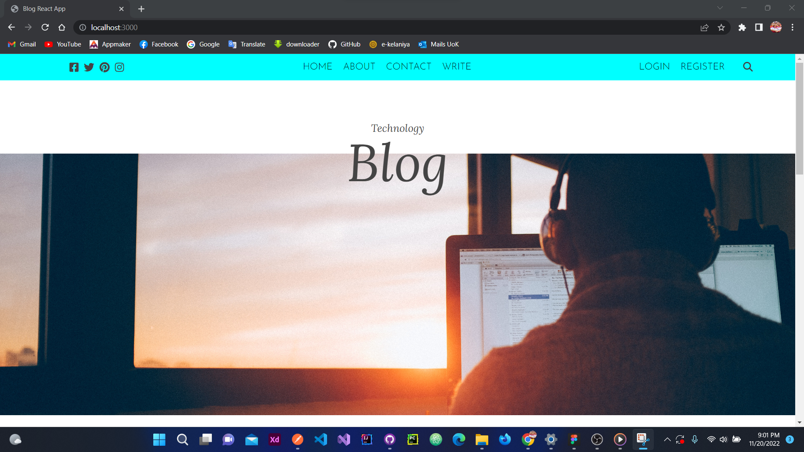
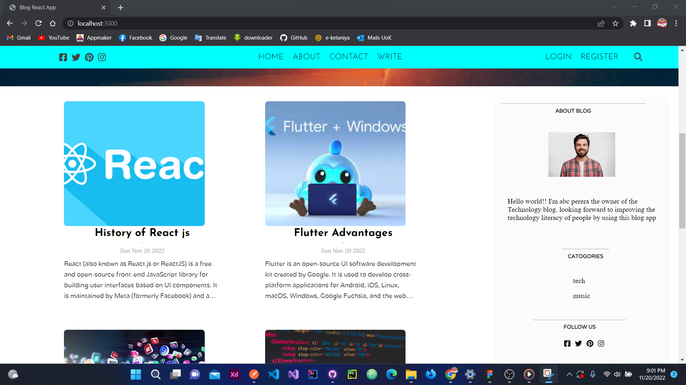

# MERN-Blog-App
 

<h2>full-stack simple blog Website using MERN Stack.</h2>
 

 

<h2>Features</h2>
1.Add new user(Register)
 
2.Update user
 
3.Add new posts
 
4.update Posts
 
5.delete Posts
 
6.Search posts by using the writer's name
 
7.Add categories
 

<h2>Technologies</h2>
 
FrontEnd -ReactJs
 
BackEnd -ExpressJs/Node
 
Database- MongoDB Atlas(CRUD operations)
 
API -REST API(CRUD Operations)
